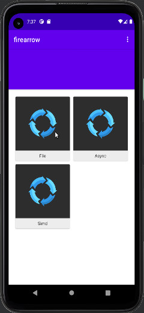
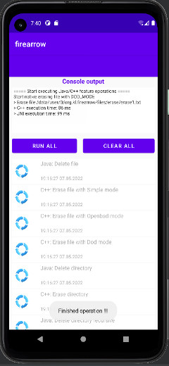
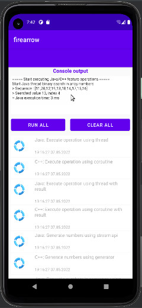
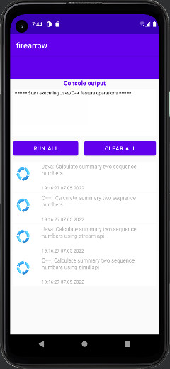

# firearrow

Android application for test and measure Java/C++ features.

The purpose of the application is to test, compare and measure time execution  
 Java/C++ simialar functionalities.

Features:
---------
  * filesystem - compare Java vs C++ erase file facilities
  * async      - compare Java vs C++ asynchronously facilities
  * simd       - compare Java vs C++ vector instruction facilities
  * network    - compare Java vs C++ network facilities

Architecture:
-------------
MVVM (Model View ViewModel)

Used Android libraries:
-----------------------
  * AppCompat
  * App Startup
  * Lifecycle/LiveData
  * ViewModel
  * Pagging
  * Navigation
  * Room
  * DataStore
  * WorkManager
  
Used third party libraries:
--------------------------
  * Timber
  * Glide
  * Hilt
  * RxJava3

Languages:
----------
  * Java 11
  * C++ 20
  
